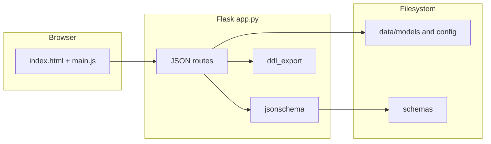

# Madalier — design overview

This document summarizes architecture, on-disk layout, and the HTTP API so contributors and coding agents can orient quickly. Authoritative JSON contracts live under [`schemas/`](schemas/).

## Purpose

Madalier is a **local web application** for authoring and editing **logical data models**: entities, attributes, and relationships, with a **diagram** (Cytoscape.js), **working copies** while editing, and export to **CSV** and **multi-dialect DDL** files on disk. The server is **Flask**; there is no separate build step for the front end.

## System context

## On-disk layout

- **Models root:** `data/models/<technical_name>/`
  - **Canonical model:** `<technical_name>.json` — saved “official” model document (validated against [`schemas/model.json`](schemas/model.json)).
  - **Canonical layout:** `layout_<technical_name>.json` — entity positions ([`schemas/layout.json`](schemas/layout.json)).
  - **Working copy (while editing):** `temp/temp_<technical_name>.json` and `temp/layout_temp_<technical_name>.json`. The UI edits the working copy; **Save** promotes layout + model to canonical paths and regenerates artifacts.
  - **Legacy working files:** Older installs may have `temp_*.json` in the model folder root; [`app.py`](app.py) resolves paths with fallbacks (`resolved_model_json_path`, `resolved_layout_json_path`).
  - **Exports:** `<technical_name>.csv`, `<technical_name>.png` (diagram snapshot), and `ddls/<variant>/<dialect>/<entity_technical_name>.sql` where `variant` is `full` (PKs + inline FKs) or `simple` (columns and nullability only), and `dialect` is one of: `sqlite`, `mysql`, `postgres`, `snowflake`, `mssql`, `databricks` (see [`ddl_export.py`](ddl_export.py)).
  - **Per-model meta-field template (optional):** `config/meta_config.json` — overrides the global default for that model (validated against [`schemas/meta_config.json`](schemas/meta_config.json)).
- **Naming rules for the UI:** [`data/config/naming_config.json`](data/config/naming_config.json), validated by [`schemas/naming.json`](schemas/naming.json).
- **Default meta-field template:** [`data/config/default_meta_config.json`](data/config/default_meta_config.json), validated by [`schemas/meta_config.json`](schemas/meta_config.json). The effective template for a model is `config/meta_config.json` when present, otherwise this file.

`technical_name` values are **lower_snake_case** identifiers (`^[a-z][a-z0-9_]*$`); they double as the canonical on-disk folder name.

## Key concepts

| Concept | Description |
|--------|-------------|
| **Stem** | Base name for JSON files: canonical stem equals `technical_name`; working stem is `temp_<technical_name>`. |
| **Open model** | Copies canonical model + layout into working `temp_*` files for editing. |
| **Save model** | Validates working model + layout, writes canonical JSON, runs `write_canonical_model_artifacts` (CSV, DDL, optional PNG), optionally supersedes another canonical model. |
| **Rename working** | Changes the draft folder / working filenames when the user’s desired `technical_name` changes before first canonical save (or adjusts paths accordingly); uses `os.rename` with rollback on failure. |
| **Meta fields** | Optional root flag `meta_fields_enabled` on the model document. When true, the UI syncs **template** fields onto every **table** entity as normal attributes with `is_meta: true` (same DDL/CSV behavior; no keys; not usable as relationship endpoints). Template source: `data/models/<technical_name>/config/meta_config.json` if it exists, else `data/config/default_meta_config.json`. |

## Table meta fields (summary)

- **Model document:** [`schemas/model.json`](schemas/model.json) adds optional `meta_fields_enabled` and per-attribute `is_meta`. Meta attributes must have `key_type` null or omitted and may exist only on `entity_type: "table"`.
- **Template JSON:** [`schemas/meta_config.json`](schemas/meta_config.json) describes a `fields` array (business/technical names, data types, optional mandatory/definition/source_mapping/precision/scale — no `key_type`).
- **Server invariants:** On save, the API rejects relationships that reference meta attributes and rejects meta attributes on views or with a non-null key type (see `validate_model_meta_invariants` in [`app.py`](app.py)).
- **CSV:** An extra column `is_meta` is written per attribute row (see `MODEL_CSV_COLUMNS` in [`app.py`](app.py)).

## HTTP API (summary)

| Method | Path | Purpose |
|--------|------|---------|
| `GET` | `/` | Serve main UI ([`templates/index.html`](templates/index.html)). |
| `GET` | `/api/list_technical_names` | List canonical models (folders with valid `technical_name` and matching JSON). |
| `GET` | `/api/naming_config` | Return naming config JSON (validated). |
| `GET` | `/api/default_meta_config` | Return global default meta template JSON (validated against `schemas/meta_config.json`). |
| `POST` | `/api/model_meta_config` | Body: `technical_name`, optional `working`. Returns `{ uses_default, config }` — override from `config/meta_config.json` when present, else default file. |
| `POST` | `/api/save_model_meta_config` | Body: `technical_name`, `config`. Writes `data/models/<technical_name>/config/meta_config.json`. |
| `POST` | `/api/promote_meta_config_to_default` | Body: `technical_name`. Copies that model’s `config/meta_config.json` to `data/config/default_meta_config.json`. |
| `POST` | `/api/create_model` | Body: `name`, `technical_name`, `description`, `version`, `created_by`. Creates empty working model + empty layout. |
| `POST` | `/api/open_model` | Body: `technical_name`. Copy canonical → working. |
| `POST` | `/api/rename_working_model` | Body: `from_technical_name`, `to_technical_name`. Rename draft / working paths. |
| `POST` | `/api/load_model` | Body: `technical_name`, optional `working: true`. Load model JSON (schema-checked; errors logged). |
| `POST` | `/api/load_layout` | Same envelope; returns `layout` array or empty. |
| `POST` | `/api/save_working_model` | Body: `working: true`, `technical_name`, `model` document. Persist working JSON only. |
| `POST` | `/api/save_layout` | Body: `technical_name`, `working`, `layout` array. |
| `POST` | `/api/save_model` | Body: `technical_name`, optional `png_base64`, optional `supersede_technical_name`. Promote working → canonical + artifacts. |
| `POST` | `/api/export_model_csv` | Body: stem envelope. Writes `<tn>.csv` under model dir. |
| `POST` | `/api/export_model_ddl` | Body: stem envelope. Writes full DDL tree under `ddls/`. |
| `POST` | `/api/save_diagram_png` | Body: `technical_name`, `png_base64`. Saves diagram PNG for canonical model folder. |

**Stem envelope** (for load/save/export helpers): JSON object with `technical_name` and optionally `"working": true` to address `temp_*` files.

Errors from intentional API validation often use JSON `{"error": "..."}` and appropriate status codes via `ApiError`.

## Where to change things

| Goal | Location |
|------|----------|
| New route, persistence, CSV, rename logic | [`app.py`](app.py) |
| DDL generation, dialect types | [`ddl_export.py`](ddl_export.py) |
| Diagram, forms, `fetch` calls | [`static/main.js`](static/main.js), [`templates/index.html`](templates/index.html) |
| JSON Schema / enums | [`schemas/`](schemas/) (includes [`meta_config.json`](schemas/meta_config.json) for meta templates) |
| Logging setup | [`app_logger.py`](app_logger.py) |

## Cross-platform notes

Path construction uses `os.path.join` and UTF-8 file I/O; the same code runs on Linux, macOS, and Windows.

- On **case-insensitive** file systems (typical Windows), avoid relying on folder names that differ only by case from `technical_name`.
- **`os.rename`** behavior can differ when targets exist or paths cross devices; avoid editing models on flaky network shares if renames fail intermittently.
- **Windows long paths:** very deep trees are unlikely; if path length errors appear, enable long-path support in the OS environment.

## See also

- [`README.md`](README.md) — setup, requirements, quick start.
- [`schemas/model.json`](schemas/model.json) — full model shape.
- [`schemas/meta_config.json`](schemas/meta_config.json) — meta-field template shape.
